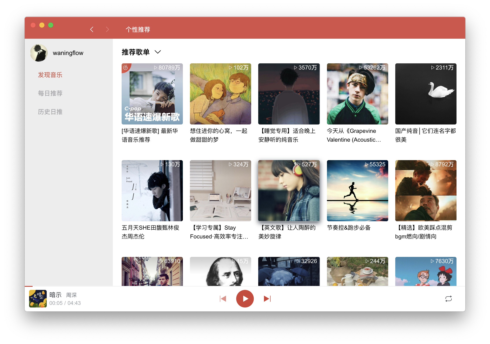
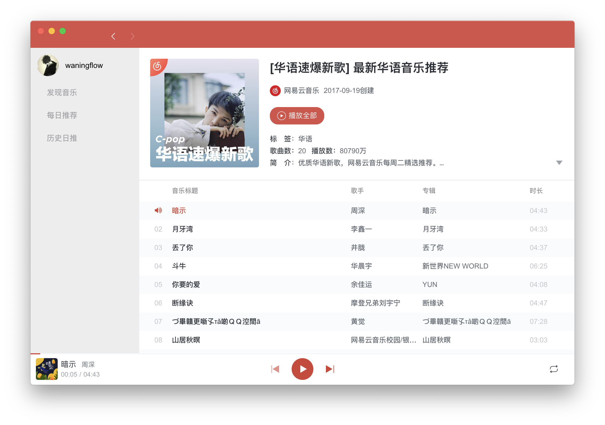

# NarutoMusic

基于 Electron 框架实现的网易云音乐精（qi）简（gai）版  
灵感来自 [Binaryify/NeteaseCloudMusicApi](https://github.com/Binaryify/NeteaseCloudMusicApi)  
当前版本 [v1.0.0-beta3](https://github.com/waningflow/NarutoMusic/releases/tag/v1.0.0-beta3)，点击下载体验

## 界面预览

## RoadMap

- [x] 每日推荐
  - [x] 历史日推
- [ ] 发现音乐
  - [x] 个性推荐
    - [x] 推荐歌单
    - [ ] 最新音乐
  - [ ] 歌单
  - [ ] 排行榜
  - [ ] 歌手
  - [ ] 最新音乐
- [ ] 我的歌单
  - [ ] 创建的歌单
  - [ ] 收藏的歌单
- [ ] 播放界面
- [ ] 搜索
- [ ] 换肤
